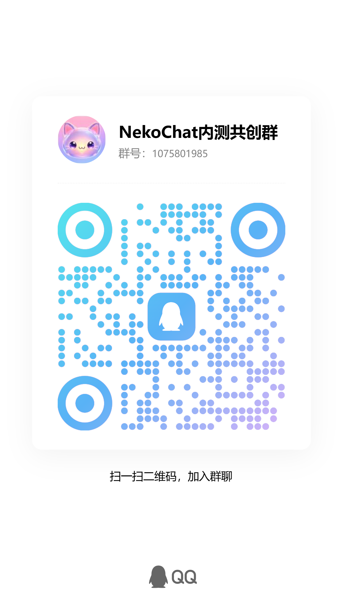

# NekoRoom

NekoRoom 是一个正在开发中的开源 AI 陪伴项目，关注自然对话、语音交互、角色体验、记忆和 Agent 能力。

> 内测交流：扫码加入 [NekoChat 内测共创群](#交流)

项目目前处于早期预览阶段，功能、目录结构、接口和内部命名都可能变化。首个源码版本会保留历史项目 `NekoChat` 的代码和命名，后续再通过独立 PR 逐步迁移到 NekoRoom。

## 当前方向

- 本地和云端大语言模型
- 语音识别、语音活动检测和语音合成
- 角色、人格和 Live2D 体验
- 对话上下文、长期记忆和 Agent 运行时
- 尽可能优先本地部署和端侧运行

部分功能仍在实验或重构中，当前仓库不是完成版产品。

## 默认模型

应用会将模型保存到应用的 `models/` 目录下，下面是当前代码中的默认配置：

| 能力 | 默认模型 | 模型仓库 | 设备目录（相对于 `models/`） | 备注 |
|---|---|---|---|---|
| LLM | Neko 猫娘 v1.1 | `jiaohui/qwen35_08b_nekoneko_v2.1-MNN` | `llm/qwen35_08b_nekoneko_v2.1-MNN/` | Jiaohuix 训练/维护 |
| TTS | NekoVoice 1.3 | `jiaohui/NekoVoice-1.3` | `tts/v13-int8/` | Jiaohuix 训练/维护 |
| ASR | 语音识别 1.2 | `jiaohui/zipformer-medium-MNN` | `asr/medium-fp16/` | 默认语音识别模型 |

模型权重不随源码仓库发布，应用运行时按需下载或从本地补齐。模型及数据集仍需遵守各自的授权条款。

## TTS 数据致谢

感谢 [NekoAudio-80K](https://huggingface.co/datasets/liumindmind/Neko_Audio-80K_Shor) 数据集，为 NekoVoice 的训练和实验提供了帮助。

## 核心项目致谢

本项目的实现和运行依赖以下核心项目：

- [MNN](https://github.com/alibaba/MNN)：端侧神经网络推理框架。
- [sherpa-mnn](https://github.com/k2-fsa/sherpa-mnn)：语音识别及相关语音能力支持。
- [SuperTonic](https://github.com/supertone-inc/supertonic)：端侧语音合成能力和推理流程参考。
- [Live2D Cubism SDK](https://www.live2d.com/)：Live2D 角色渲染支持，须遵守官方授权条款。
- [NekoAudio-80K](https://huggingface.co/datasets/liumindmind/Neko_Audio-80K_Shor)：NekoVoice 训练和实验使用的猫娘语音数据集。

上述项目、模型、数据集和 SDK 的版权及许可证归各自权利人所有；本仓库的 AGPL-3.0-only 不会替代或扩展它们各自的授权范围。

## 初始源码计划

第一份源码 PR 计划导入现有 NekoChat 实现，尽量保持原有结构，避免把大规模改名和功能变更混在同一个 PR 中。后续会单独处理包名、模块名、界面文字和资源名称迁移。

## 许可证

本仓库中没有另行声明的源代码，使用 GNU Affero General Public License v3.0 only（`AGPL-3.0-only`）。完整文本见 [LICENSE](LICENSE)。

第三方库、模型、数据集、字体、音频、角色图片、Live2D 模型和其他媒体资源不自动适用本仓库许可证，必须遵守各自的授权条款。发布前请阅读 [THIRD_PARTY_NOTICES.md](THIRD_PARTY_NOTICES.md)。

NekoRoom、NekoAI-Labs、Logo 和官方品牌不因源代码采用 AGPL 而自动授权给衍生项目，详见 [TRADEMARKS.md](TRADEMARKS.md)。

## 参与贡献

本项目采用 Fork + Pull Request 流程：从最新的 `main` 创建一个聚焦的分支，完成修改和测试后提交 PR。详细要求见 [CONTRIBUTING.md](CONTRIBUTING.md)。

## 交流

NekoChat 内测共创群：

扫码加入群聊。二维码和群聊信息仅用于项目交流，请勿用于商业宣传或冒充官方渠道。

## 安全

请不要在公开 Issue 中提交 API Key、Token、私钥、个人数据或未公开的漏洞细节。安全问题请阅读 [SECURITY.md](SECURITY.md)。

项目仍在积极开发中，首个公开版本只是开放协作的起点，并不代表功能已经完成。
